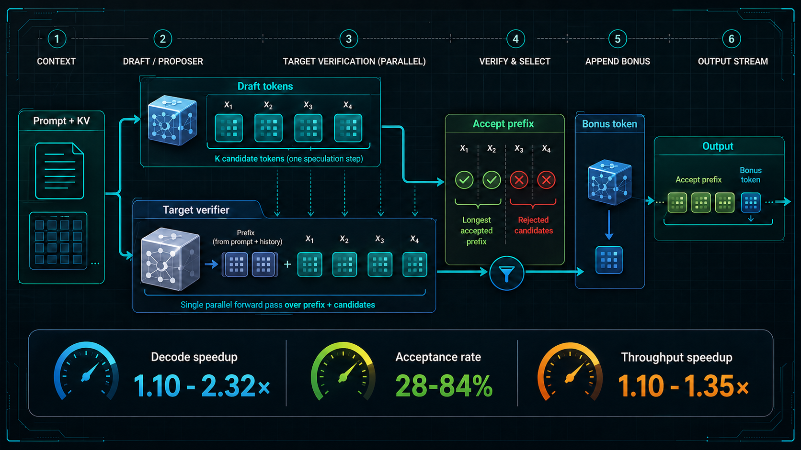

# Speculative Decoding Implementations



This repository implements speculative decoding methods from scratch and benchmarks them behind one shared decoding contract.

Every method plugs into the same target-model interface, greedy verifier, metrics schema, and autoregressive baseline, so speedups and acceptance rates are comparable across proposer designs rather than artifacts of separate evaluation code.

## Implemented Methods

| Method | Directory | Summary | Runtime support |
| --- | --- | --- | --- |
| EAGLE-3 | `methods/eagle3` | Low/mid/high hidden-state fusion with a lightweight autoregressive drafter, plus a ModelOpt comparison workflow. | non-vLLM and vLLM |
| Draft model | `methods/draft_model` | Small Qwen-style draft LM trained from Qwen2.5-7B greedy completions, then used with standard speculative verification. | non-vLLM and vLLM |
| PARD / parallel draft models | `methods/parallel_draft_models` | Parallel future-token heads that predict multiple draft positions in one target-state pass, with non-vLLM and vLLM benchmark paths. | non-vLLM and vLLM |
| Medusa-1 | `methods/medusa_1` | Frozen-backbone future-token heads trained on target completions; non-vLLM inference verifies top-k Medusa tree candidates with a masked Qwen tree forward. | non-vLLM |
| N-gram prompt lookup | `methods/ngram` | Training-free proposer that finds repeated n-grams in the current prompt and accepted generation history, then verifies drafted continuations with the target model. | non-vLLM and vLLM |
| Suffix decoding | `methods/suffix_decoding` | Training-free suffix-frequency proposer over prompt/generated history, with optional bounded cache persistence and target verification. | non-vLLM and vLLM |

The project uses `uv` with Python 3.12. From a fresh clone, this creates `.venv`, installs the project, and resolves dependencies from `pyproject.toml`:

```bash
uv sync --python 3.12
```

The experiments reported here were run on an H100 GPU.

Model checkpoints and vLLM exports are available under the [`checkpoints/` folder](https://drive.google.com/drive/folders/1SV9VgCYe1oEJs6T29nvprDP-ody4SOmd) in Google Drive.

## EAGLE-3

Paper: [EAGLE-3: Scaling up Inference Acceleration of Large Language Models via Training-Time Test](https://arxiv.org/abs/2503.01840).

Current reference artifacts:

- checkpoint, `ttt_steps=3`: [`checkpoints/eagle3_qwen25_7b_eval100_ce_len3`](https://drive.google.com/drive/folders/1TNIKVrKlE-qdmps8ABq9FZbtKtVw37gI)
- vLLM export, `ttt_steps=3`: [`checkpoints/vllm_exports/eagle3_eval100_len2`](https://drive.google.com/drive/folders/1xYORlRlmGyMdC9c5KTaUL7vcqHKag1x5)
- checkpoint, `ttt_steps=6` and best vLLM result: [`checkpoints/eagle3_qwen25_7b_eval100_ce_ttt6_len3`](https://drive.google.com/drive/folders/13-SFBI1DtGAf3DXUxywfZMq5Dv1ny2rf)
- vLLM export, `ttt_steps=6`: [`checkpoints/vllm_exports/eagle3_eval100_ttt6_len2`](https://drive.google.com/drive/folders/1-THyU0wGgQ7q5ykJPveF6nGKeWD2BdqR)
- target model: `Qwen/Qwen2.5-7B-Instruct`
- full distillation set: `data/ultrachat_3000_trunc1024_qwen25_7b_greedy128_ids.jsonl`
- reference overfit train/eval set: `data/ultrachat_3000_train_eval100_qwen25_7b_greedy128_ids.jsonl`
- eval setup: `100` train-overlap prompts, `max_new_tokens=128`
- best inference draft length: `2`

`draft_len=2` is the inference setting: each EAGLE-3 speculation step uses one target/base seed token plus up to two EAGLE-proposed speculative tokens, so a fully accepted step can emit up to three tokens. The checkpoint suffix `len3` refers to the training rollout/checkpoint configuration, not the best inference draft length.

Latest implementation benchmark results. All vLLM rows use `--gpu-memory-utilization 0.85` for both the baseline engine and the speculative engine.

| Path | Train TTT | Baseline wall time | EAGLE wall time | Baseline mean latency | EAGLE mean latency | Baseline throughput | EAGLE throughput | Speedup | Acceptance |
| --- | ---: | ---: | ---: | ---: | ---: | ---: | ---: | ---: | ---: |
| vLLM batched throughput (`max_num_seqs=16`) | `3` | `6.6098s` | `5.5455s` | n/a | n/a | `1834.09 tok/s` | `2186.82 tok/s` | `1.1919x` | `46.29%` |
| vLLM serial latency (`max_num_seqs=1`) | `3` | `74.3867s` | `50.1959s` | `0.7439s` | `0.5020s` | `162.74 tok/s` | `241.57 tok/s` | `1.4819x` | `44.72%` |
| vLLM batched throughput (`max_num_seqs=16`) | `6` | `6.6371s` | `4.9285s` | n/a | n/a | `1825.80 tok/s` | `2459.57 tok/s` | `1.3467x` | `59.78%` |
| vLLM serial latency (`max_num_seqs=1`) | `6` | `74.4072s` | `45.0488s` | `0.7441s` | `0.4505s` | `162.70 tok/s` | `269.17 tok/s` | `1.6517x` | `56.41%` |
| non-vLLM PyTorch loop | `3` | `195.8243s` | `155.1596s` | `1.9582s` | `1.5516s` | `61.73 tok/s` | `77.91 tok/s` | `1.2621x` | `36.13%` |
| non-vLLM PyTorch loop | `6` | `193.4679s` | `162.2932s` | `1.9347s` | `1.6229s` | `62.52 tok/s` | `74.53 tok/s` | `1.1921x` | `28.22%` |

NVIDIA ModelOpt comparison on the same 100-prompt eval slice:

| Path | Baseline wall time | ModelOpt EAGLE wall time | Baseline mean latency | ModelOpt EAGLE mean latency | Baseline throughput | ModelOpt EAGLE throughput | Speedup | Acceptance |
| --- | ---: | ---: | ---: | ---: | ---: | ---: | ---: | ---: |
| vLLM batched throughput (`max_num_seqs=16`) | `6.6179s` | `5.5881s` | n/a | n/a | `1831.85 tok/s` | `2165.32 tok/s` | `1.1843x` | `43.00%` |
| vLLM serial latency (`max_num_seqs=1`) | `74.4597s` | `51.8207s` | `0.7446s` | `0.5182s` | `162.58 tok/s` | `234.00 tok/s` | `1.4369x` | `41.95%` |

Benchmark files:

- vLLM batched: `runs/eagle3_eval100_ce_len2_vllm_batched.summary.json`
- vLLM serial: `runs/eagle3_eval100_ce_len2_vllm_serial.summary.json`
- vLLM batched, `ttt_steps=6`: `runs/eagle3_eval100_ce_ttt6_len2_vllm_batched.summary.json`
- vLLM serial, `ttt_steps=6`: `runs/eagle3_eval100_ce_ttt6_len2_vllm_serial.summary.json`
- non-vLLM: `runs/eagle3_eval100_ce_len2_nonvllm.jsonl`
- non-vLLM, `ttt_steps=6`: `runs/eagle3_eval100_ce_ttt6_len2_nonvllm.jsonl`
- ModelOpt vLLM batched: `runs/eagle3_modelopt_eval100_len2_vllm_batched.summary.json`
- ModelOpt vLLM serial: `runs/eagle3_modelopt_eval100_len2_vllm_serial.summary.json`

Output divergence from the baseline is diagnostic only for EAGLE-3 runs. The benchmark records `matches_baseline`, diverged prompt counts, and token-count mismatches, but speedup is computed from the measured wall time and generated-token throughput.

### EAGLE-3 Commands

Prepare the UltraChat distillation data with vLLM greedy completions:

```bash
CUDA_VISIBLE_DEVICES=0 uv run python methods/eagle3/training/train.py prepare-data \
  --target-model-path Qwen/Qwen2.5-7B-Instruct \
  --output data/ultrachat_3000_trunc1024_qwen25_7b_greedy128_ids.jsonl \
  --eval-output data/ultrachat_3000_train_eval100_qwen25_7b_greedy128_ids.jsonl \
  --num-samples 3000 \
  --eval-samples 100 \
  --max-prompt-tokens 1024 \
  --completion-tokens 128 \
  --dtype bf16 \
  --gpu-memory-utilization 0.75 \
  --max-model-len 1184
```

Train the current reference checkpoint:

```bash
CUDA_VISIBLE_DEVICES=0 uv run python methods/eagle3/training/train.py train \
  --target-model-path Qwen/Qwen2.5-7B-Instruct \
  --data data/ultrachat_3000_train_eval100_qwen25_7b_greedy128_ids.jsonl \
  --output checkpoints/eagle3_qwen25_7b_eval100_ce_len3 \
  --seq-len 1152 \
  --steps 3000 \
  --batch-size 1 \
  --grad-accum 1 \
  --lr 1e-4 \
  --draft-len 3 \
  --ttt-steps 3 \
  --num-draft-layers 1 \
  --selected-layers 1,13,24 \
  --loss-decay 1.0 \
  --loss-type ce \
  --grad-clip 0.5 \
  --dtype bf16 \
  --device cuda
```

For the higher-TTT checkpoint used in the `ttt_steps=6` rows, run the same training command with `--output checkpoints/eagle3_qwen25_7b_eval100_ce_ttt6_len3` ([Drive folder](https://drive.google.com/drive/folders/13-SFBI1DtGAf3DXUxywfZMq5Dv1ny2rf)) and `--ttt-steps 6`.

Run non-vLLM PyTorch inference:

```bash
CUDA_VISIBLE_DEVICES=0 uv run python methods/eagle3/inference/infer.py \
  --model-path Qwen/Qwen2.5-7B-Instruct \
  --checkpoint-path checkpoints/eagle3_qwen25_7b_eval100_ce_len3 \
  --prompts data/ultrachat_3000_train_eval100_qwen25_7b_greedy128_ids.jsonl \
  --output runs/eagle3_eval100_ce_len2_nonvllm.jsonl \
  --max-new-tokens 128 \
  --draft-len 2 \
  --dtype bf16 \
  --device cuda \
  --allow-divergence
```

Run non-vLLM PyTorch inference for the `ttt_steps=6` checkpoint:

```bash
CUDA_VISIBLE_DEVICES=0 uv run python methods/eagle3/inference/infer.py \
  --model-path Qwen/Qwen2.5-7B-Instruct \
  --checkpoint-path checkpoints/eagle3_qwen25_7b_eval100_ce_ttt6_len3 \
  --prompts data/ultrachat_3000_train_eval100_qwen25_7b_greedy128_ids.jsonl \
  --output runs/eagle3_eval100_ce_ttt6_len2_nonvllm.jsonl \
  --max-new-tokens 128 \
  --draft-len 2 \
  --dtype bf16 \
  --device cuda \
  --allow-divergence
```

Run vLLM batched throughput inference:

```bash
CUDA_VISIBLE_DEVICES=0 uv run python methods/eagle3/inference/infer_vllm.py \
  --model-path Qwen/Qwen2.5-7B-Instruct \
  --checkpoint-path checkpoints/eagle3_qwen25_7b_eval100_ce_len3 \
  --export-dir checkpoints/vllm_exports/eagle3_eval100_len2 \
  --prompts data/ultrachat_3000_train_eval100_qwen25_7b_greedy128_ids.jsonl \
  --output runs/eagle3_eval100_ce_len2_vllm_batched.summary.json \
  --baseline-summary-path runs/eagle3_eval100_ce_len2_vllm_batched.baseline.json \
  --max-new-tokens 128 \
  --draft-len 2 \
  --gpu-memory-utilization 0.85 \
  --max-model-len 1280 \
  --max-num-seqs 16 \
  --warmup-prompts 0
```

Run vLLM serial latency inference:

```bash
CUDA_VISIBLE_DEVICES=0 uv run python methods/eagle3/inference/infer_vllm.py \
  --model-path Qwen/Qwen2.5-7B-Instruct \
  --draft-model-path checkpoints/vllm_exports/eagle3_eval100_len2 \
  --skip-export \
  --prompts data/ultrachat_3000_train_eval100_qwen25_7b_greedy128_ids.jsonl \
  --output runs/eagle3_eval100_ce_len2_vllm_serial.summary.json \
  --baseline-summary-path runs/eagle3_eval100_ce_len2_vllm_serial.baseline.json \
  --max-new-tokens 128 \
  --draft-len 2 \
  --gpu-memory-utilization 0.85 \
  --max-model-len 1280 \
  --max-num-seqs 1 \
  --serial-prompts \
  --warmup-prompts 1
```

Run vLLM batched throughput inference for the `ttt_steps=6` checkpoint:

```bash
CUDA_VISIBLE_DEVICES=0 uv run python methods/eagle3/inference/infer_vllm.py \
  --model-path Qwen/Qwen2.5-7B-Instruct \
  --draft-model-path checkpoints/vllm_exports/eagle3_eval100_ttt6_len2 \
  --skip-export \
  --prompts data/ultrachat_3000_train_eval100_qwen25_7b_greedy128_ids.jsonl \
  --output runs/eagle3_eval100_ce_ttt6_len2_vllm_batched.summary.json \
  --baseline-summary-path runs/eagle3_eval100_ce_ttt6_len2_vllm_batched.baseline.json \
  --max-new-tokens 128 \
  --draft-len 2 \
  --gpu-memory-utilization 0.85 \
  --max-model-len 1280 \
  --max-num-seqs 16 \
  --warmup-prompts 0
```

Run vLLM serial latency inference for the `ttt_steps=6` checkpoint:

```bash
CUDA_VISIBLE_DEVICES=0 uv run python methods/eagle3/inference/infer_vllm.py \
  --model-path Qwen/Qwen2.5-7B-Instruct \
  --draft-model-path checkpoints/vllm_exports/eagle3_eval100_ttt6_len2 \
  --skip-export \
  --prompts data/ultrachat_3000_train_eval100_qwen25_7b_greedy128_ids.jsonl \
  --output runs/eagle3_eval100_ce_ttt6_len2_vllm_serial.summary.json \
  --baseline-summary-path runs/eagle3_eval100_ce_ttt6_len2_vllm_serial.baseline.json \
  --max-new-tokens 128 \
  --draft-len 2 \
  --gpu-memory-utilization 0.85 \
  --max-model-len 1280 \
  --max-num-seqs 1 \
  --serial-prompts \
  --warmup-prompts 1
```

### ModelOpt EAGLE-3 Comparison Commands

The ModelOpt path is intentionally isolated in `methods/eagle3/modelopt_experiment.py` so it can be deleted without touching the implementation. It trains with `modelopt.torch.speculative`, exports the official ModelOpt checkpoint, converts it to the vLLM/speculators checkpoint layout, and benchmarks through the same vLLM runner. ModelOpt comparison inference is vLLM-only.

One-time experiment dependencies:

```bash
mkdir -p ref_repos
if [ ! -d ref_repos/Model-Optimizer ]; then
  git clone https://github.com/NVIDIA/Model-Optimizer.git ref_repos/Model-Optimizer
fi
uv pip install --python .venv/bin/python -e ref_repos/Model-Optimizer \
  accelerate peft scipy pulp nvidia-ml-py omegaconf
```

Train, export, convert, and run the default batched vLLM benchmark:

```bash
CUDA_VISIBLE_DEVICES=0 uv run python methods/eagle3/modelopt_experiment.py \
  --mode all \
  --gpu-memory-utilization 0.85 \
  --overwrite-data \
  --overwrite-output-dir \
  --overwrite-exports
```

Run only the ModelOpt vLLM batched benchmark after the export exists:

```bash
CUDA_VISIBLE_DEVICES=0 uv run python methods/eagle3/modelopt_experiment.py \
  --mode bench \
  --max-num-seqs 16 \
  --gpu-memory-utilization 0.85 \
  --summary-output runs/eagle3_modelopt_eval100_len2_vllm_batched.summary.json \
  --baseline-summary-path runs/eagle3_modelopt_eval100_len2_vllm_batched.baseline.json
```

Run only the ModelOpt vLLM serial latency benchmark after the export exists:

```bash
CUDA_VISIBLE_DEVICES=0 uv run python methods/eagle3/modelopt_experiment.py \
  --mode bench \
  --serial-prompts \
  --max-num-seqs 1 \
  --gpu-memory-utilization 0.85 \
  --summary-output runs/eagle3_modelopt_eval100_len2_vllm_serial.summary.json \
  --baseline-summary-path runs/eagle3_modelopt_eval100_len2_vllm_serial.baseline.json
```

## Draft Model

Current reference artifact:

- checkpoint: [`checkpoints/draft_model_qwen25_05b_ultrachat3000`](https://drive.google.com/drive/folders/1Foho9UVLsHjTngvjs2qDwR_7wrYByR_L)
- target model: `Qwen/Qwen2.5-7B-Instruct`
- draft base: `Qwen/Qwen2.5-0.5B-Instruct`
- full distillation set: `data/ultrachat_3000_trunc1024_qwen25_7b_greedy128_ids.jsonl`
- reference eval set: `data/ultrachat_3000_train_eval100_qwen25_7b_greedy128_ids.jsonl`
- eval setup: `100` train-overlap prompts, `max_new_tokens=128`
- best measured inference draft length: `2`

The current draft-model checkpoint was trained from scratch on the 3000-row UltraChat/Qwen2.5-7B completion set, not resumed from the 100-row overfit checkpoint. Final teacher-forced eval on the 100-row eval file:

- eval loss: `0.1941`
- top-1 match: `95.17%`
- acceptance proxy: `92.86%`
- mean accepted tokens per step proxy: `1.8567`

Latest draft-model benchmark results. All vLLM rows use `--gpu-memory-utilization 0.85` for both the baseline engine and the speculative engine.

| Path | Baseline wall time | Draft-model wall time | Baseline mean latency | Draft-model mean latency | Baseline throughput | Draft-model throughput | Speedup | Acceptance |
| --- | ---: | ---: | ---: | ---: | ---: | ---: | ---: | ---: |
| vLLM batched throughput (`max_num_seqs=16`) | `6.6198s` | `6.9635s` | n/a | n/a | `1830.57 tok/s` | `1740.93 tok/s` | `0.9506x` | `82.09%` |
| vLLM serial latency (`max_num_seqs=1`) | `74.4407s` | `71.4878s` | `0.7444s` | `0.7149s` | `162.63 tok/s` | `169.65 tok/s` | `1.0413x` | `81.55%` |
| non-vLLM PyTorch loop | `201.1899s` | `368.4114s` | `2.0119s` | `3.6841s` | `60.21 tok/s` | `32.88 tok/s` | `0.5461x` | `81.79%` |

For vLLM batched throughput, `draft_len=3` was worse on the same baseline: `0.8710x` speedup with `77.09%` acceptance. The non-vLLM PyTorch path reaches high acceptance but remains slower because it pays a separate 0.5B draft-model forward loop in Python.

Benchmark files:

- vLLM batched: `runs/draft_model_ultrachat3000_len2_vllm_batched.summary.json`
- vLLM serial: `runs/draft_model_ultrachat3000_len2_vllm_serial.summary.json`
- vLLM batched, `draft_len=3`: `runs/draft_model_ultrachat3000_len3_vllm_batched.summary.json`
- non-vLLM: `runs/draft_model_ultrachat3000_len2_nonvllm.jsonl`

Output divergence from the baseline is diagnostic only for draft-model runs. The benchmark records `matches_baseline`, diverged prompt counts, and token-count mismatches, but speedup is computed from measured wall time and generated-token throughput.

### Draft-Model Commands

Train the current reference checkpoint:

```bash
CUDA_VISIBLE_DEVICES=0 uv run python methods/draft_model/training/train.py \
  --target-model-path Qwen/Qwen2.5-7B-Instruct \
  --data data/ultrachat_3000_trunc1024_qwen25_7b_greedy128_ids.jsonl \
  --eval-data data/ultrachat_3000_train_eval100_qwen25_7b_greedy128_ids.jsonl \
  --output checkpoints/draft_model_qwen25_05b_ultrachat3000 \
  --seq-len 1152 \
  --epochs 2 \
  --batch-size 1 \
  --grad-accum 1 \
  --lr 5e-5 \
  --weight-decay 0.0 \
  --max-grad-norm 0.5 \
  --eval-interval 1000 \
  --eval-batch-size 1 \
  --eval-draft-len 2 \
  --log-interval 250 \
  --dtype bf16 \
  --device cuda \
  --init-model-path Qwen/Qwen2.5-0.5B-Instruct
```

Run non-vLLM PyTorch inference:

```bash
CUDA_VISIBLE_DEVICES=0 uv run python methods/draft_model/inference/infer.py \
  --model-path Qwen/Qwen2.5-7B-Instruct \
  --checkpoint-path checkpoints/draft_model_qwen25_05b_ultrachat3000 \
  --prompts data/ultrachat_3000_train_eval100_qwen25_7b_greedy128_ids.jsonl \
  --output runs/draft_model_ultrachat3000_len2_nonvllm.jsonl \
  --max-new-tokens 128 \
  --draft-len 2 \
  --dtype bf16 \
  --device cuda
```

Run vLLM batched throughput inference:

```bash
CUDA_VISIBLE_DEVICES=0 uv run python methods/draft_model/inference/infer_vllm.py \
  --mode both \
  --model-path Qwen/Qwen2.5-7B-Instruct \
  --draft-model-path checkpoints/draft_model_qwen25_05b_ultrachat3000 \
  --prompts data/ultrachat_3000_train_eval100_qwen25_7b_greedy128_ids.jsonl \
  --output runs/draft_model_ultrachat3000_len2_vllm_batched.summary.json \
  --baseline-summary-path runs/draft_model_ultrachat3000_len2_vllm_batched.baseline.json \
  --max-new-tokens 128 \
  --draft-len 2 \
  --gpu-memory-utilization 0.85 \
  --max-model-len 1280 \
  --max-num-seqs 16 \
  --warmup-prompts 0
```

Run vLLM serial latency inference:

```bash
CUDA_VISIBLE_DEVICES=0 uv run python methods/draft_model/inference/infer_vllm.py \
  --mode both \
  --model-path Qwen/Qwen2.5-7B-Instruct \
  --draft-model-path checkpoints/draft_model_qwen25_05b_ultrachat3000 \
  --prompts data/ultrachat_3000_train_eval100_qwen25_7b_greedy128_ids.jsonl \
  --output runs/draft_model_ultrachat3000_len2_vllm_serial.summary.json \
  --baseline-summary-path runs/draft_model_ultrachat3000_len2_vllm_serial.baseline.json \
  --max-new-tokens 128 \
  --draft-len 2 \
  --gpu-memory-utilization 0.85 \
  --max-model-len 1280 \
  --max-num-seqs 1 \
  --serial-prompts \
  --warmup-prompts 1
```


## Parallel Draft Model (PARD)

Paper: [PARD: Accelerating LLM Inference with Low-Cost PARallel Draft Model Adaptation](https://arxiv.org/abs/2504.18583).

Current reference artifact:

- checkpoint: [`checkpoints/parallel_draft_models_qwen25_05b_ultrachat3000`](https://drive.google.com/drive/folders/17fYaopuGkUpQfa-DWwshaP04tLLRU2hA)
- target model: `Qwen/Qwen2.5-7B-Instruct`
- draft base: `Qwen/Qwen2.5-0.5B-Instruct`
- full distillation set: `data/ultrachat_3000_trunc1024_qwen25_7b_greedy128_ids.jsonl`
- reference eval set: `data/ultrachat_3000_train_eval100_qwen25_7b_greedy128_ids.jsonl`
- eval setup: `100` train-overlap prompts, `max_new_tokens=128`
- best measured non-vLLM inference draft length: `5`
- best measured vLLM inference draft length: `3`

The PARD checkpoint is a standard Hugging Face Qwen2 draft-model directory that vLLM can load directly with `parallel_drafting=True`. It exports the target tokenizer vocabulary size (`152064`), `pard_token=151665`, and `spd_type=pard`.

The checkpoint was trained from `Qwen/Qwen2.5-0.5B-Instruct` on the 3000-row UltraChat/Qwen2.5-7B completion set with the PARD `draft_len=8` objective. Final teacher-forced eval proxy on the 100-row train-overlap eval file:

- first-token match: `92.70%`
- length-8 acceptance proxy: `31.82%`
- mean accepted tokens per PARD step proxy: `2.5375`

More PARD results and implementation notes are available in [`README_PARD.md`](README_PARD.md).

Latest PARD benchmark results. All vLLM rows use fixed `gpu_memory_utilization=0.85` for both the baseline engine and the speculative engine.

| Path | Inference draft length | Baseline wall time | PARD wall time | Baseline mean latency | PARD mean latency | Baseline throughput | PARD throughput | Speedup | Acceptance |
| --- | ---: | ---: | ---: | ---: | ---: | ---: | ---: | ---: | ---: |
| vLLM batched throughput (`max_num_seqs=16`) | `3` | `6.6162s` | `5.0411s` | n/a | n/a | `1832.33 tok/s` | `2403.04 tok/s` | `1.3124x` | `60.96%` |
| vLLM serial latency (`max_num_seqs=1`) | `3` | `74.3739s` | `40.6290s` | `0.7437s` | `0.4063s` | `162.77 tok/s` | `298.51 tok/s` | `1.8306x` | `60.22%` |
| non-vLLM PyTorch loop | `5` | `214.5692s` | `155.2519s` | `2.1457s` | `1.5525s` | `56.19 tok/s` | `77.66 tok/s` | `1.3821x` | `30.96%` |

The non-vLLM summary JSON reports per-prompt means of `1.4424x` speedup, `80.99 tok/s` PARD throughput, and `33.39%` acceptance. The table above uses aggregate wall-clock timing across all 100 prompts for consistency with the vLLM rows.

vLLM batched sweep on the same baseline:

| Inference draft length | Speedup | PARD throughput | Acceptance |
| ---: | ---: | ---: | ---: |
| `2` | `1.2672x` | `2321.55 tok/s` | `74.77%` |
| `3` | `1.3124x` | `2403.04 tok/s` | `60.96%` |
| `4` | `1.3004x` | `2381.77 tok/s` | `50.50%` |
| `5` | `1.2156x` | `2225.08 tok/s` | `41.40%` |

Non-vLLM 20-prompt screening sweep:

| Inference draft length | Speedup | PARD throughput | Acceptance |
| ---: | ---: | ---: | ---: |
| `2` | `1.2092x` | `70.69 tok/s` | `60.06%` |
| `3` | `1.3220x` | `73.25 tok/s` | `47.28%` |
| `4` | `1.3895x` | `79.43 tok/s` | `38.42%` |
| `5` | `1.4062x` | `80.81 tok/s` | `32.58%` |
| `6` | `1.3806x` | `80.15 tok/s` | `26.71%` |

Benchmark files:

- non-vLLM full: `runs/parallel_draft_models_len5_nonvllm.jsonl`, `runs/parallel_draft_models_len5_nonvllm.summary.json`
- vLLM batched baseline: `runs/parallel_draft_models_vllm_batched.baseline.json`
- vLLM batched best: `runs/parallel_draft_models_len3_vllm_batched.summary.json`
- vLLM serial baseline: `runs/parallel_draft_models_vllm_serial.baseline.json`
- vLLM serial best: `runs/parallel_draft_models_len3_vllm_serial.summary.json`
- vLLM batched sweep: `runs/parallel_draft_models_len2_vllm_batched.summary.json`, `runs/parallel_draft_models_len4_vllm_batched.summary.json`, `runs/parallel_draft_models_len5_vllm_batched.summary.json`
- non-vLLM screening sweep: `runs/parallel_draft_models_len2_nonvllm_20.summary.json` through `runs/parallel_draft_models_len6_nonvllm_20.summary.json`

Output divergence from the baseline is diagnostic only for PARD runs. The benchmark records `matches_baseline`, diverged prompt counts, and token-count mismatches, but speedup is computed from measured wall time and generated-token throughput.

### PARD Commands

Train the current reference checkpoint:

```bash
CUDA_VISIBLE_DEVICES=0 \
PYTORCH_CUDA_ALLOC_CONF=expandable_segments:True \
uv run python methods/parallel_draft_models/training/train.py \
  --target-model-path Qwen/Qwen2.5-7B-Instruct \
  --draft-base-model-path Qwen/Qwen2.5-0.5B-Instruct \
  --data data/ultrachat_3000_trunc1024_qwen25_7b_greedy128_ids.jsonl \
  --eval-data data/ultrachat_3000_train_eval100_qwen25_7b_greedy128_ids.jsonl \
  --output checkpoints/parallel_draft_models_qwen25_05b_ultrachat3000 \
  --steps 1500 \
  --batch-size 8 \
  --grad-accum 1 \
  --seq-len 512 \
  --draft-len 8 \
  --lr 3e-5 \
  --cod-ratio 0.7 \
  --cod-min-ratio 0.2 \
  --eval-limit 100 \
  --log-interval 25 \
  --eval-interval 250 \
  --dtype bf16 \
  --device cuda \
  --gradient-checkpointing
```

Run non-vLLM PyTorch inference with the measured best setting:

```bash
CUDA_VISIBLE_DEVICES=0 \
PYTORCH_CUDA_ALLOC_CONF=expandable_segments:True \
uv run python methods/parallel_draft_models/inference/infer.py \
  --model-path Qwen/Qwen2.5-7B-Instruct \
  --checkpoint-path checkpoints/parallel_draft_models_qwen25_05b_ultrachat3000 \
  --prompts data/ultrachat_3000_train_eval100_qwen25_7b_greedy128_ids.jsonl \
  --output runs/parallel_draft_models_len5_nonvllm.jsonl \
  --max-new-tokens 128 \
  --draft-len 5 \
  --dtype bf16 \
  --device cuda \
  --warmup-prompts 1
```

Run vLLM batched throughput inference with the measured best setting. `infer_vllm.py` intentionally fixes `gpu_memory_utilization=0.85` for both baseline and speculative engines.

```bash
CUDA_VISIBLE_DEVICES=0 \
VLLM_WORKER_MULTIPROC_METHOD=spawn \
uv run python methods/parallel_draft_models/inference/infer_vllm.py \
  --mode both \
  --model-path Qwen/Qwen2.5-7B-Instruct \
  --checkpoint-path checkpoints/parallel_draft_models_qwen25_05b_ultrachat3000 \
  --prompts data/ultrachat_3000_train_eval100_qwen25_7b_greedy128_ids.jsonl \
  --output runs/parallel_draft_models_len3_vllm_batched.summary.json \
  --baseline-summary-path runs/parallel_draft_models_vllm_batched.baseline.json \
  --max-new-tokens 128 \
  --draft-len 3 \
  --dtype bf16 \
  --max-model-len 1280 \
  --max-num-seqs 16 \
  --seed 0
```

Run vLLM serial latency inference:

```bash
CUDA_VISIBLE_DEVICES=0 \
VLLM_WORKER_MULTIPROC_METHOD=spawn \
uv run python methods/parallel_draft_models/inference/infer_vllm.py \
  --mode both \
  --model-path Qwen/Qwen2.5-7B-Instruct \
  --checkpoint-path checkpoints/parallel_draft_models_qwen25_05b_ultrachat3000 \
  --prompts data/ultrachat_3000_train_eval100_qwen25_7b_greedy128_ids.jsonl \
  --output runs/parallel_draft_models_len3_vllm_serial.summary.json \
  --baseline-summary-path runs/parallel_draft_models_vllm_serial.baseline.json \
  --max-new-tokens 128 \
  --draft-len 3 \
  --dtype bf16 \
  --max-model-len 1280 \
  --max-num-seqs 1 \
  --serial-prompts \
  --warmup-prompts 1 \
  --seed 0
```

Run only a speculative vLLM candidate against an existing baseline summary:

```bash
CUDA_VISIBLE_DEVICES=0 \
VLLM_WORKER_MULTIPROC_METHOD=spawn \
uv run python methods/parallel_draft_models/inference/infer_vllm.py \
  --mode speculative \
  --model-path Qwen/Qwen2.5-7B-Instruct \
  --checkpoint-path checkpoints/parallel_draft_models_qwen25_05b_ultrachat3000 \
  --prompts data/ultrachat_3000_train_eval100_qwen25_7b_greedy128_ids.jsonl \
  --baseline-summary-path runs/parallel_draft_models_vllm_batched.baseline.json \
  --output runs/parallel_draft_models_len4_vllm_batched.summary.json \
  --max-new-tokens 128 \
  --draft-len 4 \
  --dtype bf16 \
  --max-model-len 1280 \
  --max-num-seqs 16 \
  --seed 0
```

## Medusa-1

Paper: [Medusa: Simple LLM Inference Acceleration Framework with Multiple Decoding Heads](https://arxiv.org/abs/2401.10774).

Current reference artifacts:

- checkpoint: [`checkpoints/medusa_1_qwen25_7b_eval100`](https://drive.google.com/drive/folders/119hhIITWUwGU95FWXkltiC0cOPDX6aw9)
- target model: `Qwen/Qwen2.5-7B-Instruct`
- train/eval set: `data/ultrachat_3000_train_eval100_qwen25_7b_greedy128_ids.jsonl`
- eval setup: `100` train-overlap prompts, `max_new_tokens=128`
- best inference settings: `draft_len=4`, `tree_topk=5`, `max_tree_nodes=31`

The Medusa-1 implementation is non-vLLM only. It trains frozen-backbone future-token heads and verifies Medusa tree candidates with a local masked Qwen tree forward. Output divergence from the baseline is diagnostic only for this method; the benchmark records baseline-match fields, but speedup is computed from measured wall time and generated-token throughput.

Latest non-vLLM benchmark:

| Path | Eval prompts | Max new tokens | Baseline throughput | Medusa throughput | Speedup | Acceptance |
| --- | ---: | ---: | ---: | ---: | ---: | ---: |
| non-vLLM PyTorch loop | `100` | `128` | `63.68 tok/s` | `146.23 tok/s` | `2.2986x` | `40.77%` |

Benchmark file:

- non-vLLM: `runs/medusa_1_eval100_len4_top5_nodes31_greedy128.jsonl`, `runs/medusa_1_eval100_len4_top5_nodes31_greedy128.summary.json`

Train the current reference checkpoint:

```bash
CUDA_VISIBLE_DEVICES=0 uv run python methods/medusa_1/training/train.py \
  --target-model-path Qwen/Qwen2.5-7B-Instruct \
  --data data/ultrachat_3000_train_eval100_qwen25_7b_greedy128_ids.jsonl \
  --eval-data data/ultrachat_3000_train_eval100_qwen25_7b_greedy128_ids.jsonl \
  --output checkpoints/medusa_1_qwen25_7b_eval100 \
  --seq-len 1152 \
  --steps 300 \
  --batch-size 1 \
  --grad-accum 1 \
  --lr 1e-3 \
  --max-grad-norm 1.0 \
  --dtype bf16 \
  --device cuda \
  --limit-samples 100 \
  --eval-batches 8
```

Run non-vLLM PyTorch inference:

```bash
CUDA_VISIBLE_DEVICES=0 uv run python methods/medusa_1/inference/infer.py \
  --model-path Qwen/Qwen2.5-7B-Instruct \
  --checkpoint-path checkpoints/medusa_1_qwen25_7b_eval100 \
  --prompts data/ultrachat_3000_train_eval100_qwen25_7b_greedy128_ids.jsonl \
  --output runs/medusa_1_eval100_len4_top5_nodes31_greedy128.jsonl \
  --max-new-tokens 128 \
  --draft-len 4 \
  --tree-topk 5 \
  --max-tree-nodes 31 \
  --dtype bf16 \
  --device cuda \
  --warmup-prompts 2
```

## Training-Free Wiki Extract Dataset

Current reference artifacts:

- target model: `Qwen/Qwen2.5-7B-Instruct`
- eval set: `data/wiki_extract_ngram_eval100_qwen25_7b.jsonl`
- eval setup: first `50` prompts, `max_new_tokens=128`, `bf16`
- vLLM setup: baseline and speculative engines both use `--gpu-memory-utilization 0.85`

The Wikipedia corpus is embedded in each request: dataset prep writes the full article into `prompt` and `prompt_ids`, so both methods build draft context from that request's prompt tokens plus accepted generation history. The final runs do not use a shared external corpus index; the non-vLLM suffix script has optional `--global-cache`, but it was not used here.

Prepare the extractive Wikipedia eval set:

```bash
uv run python data/prepare_ngram_wiki.py \
  --model-path Qwen/Qwen2.5-7B-Instruct \
  --output data/wiki_extract_ngram_eval100_qwen25_7b.jsonl \
  --num-questions 100 \
  --prompt-token-budget 14336
```

## N-gram Wiki Extract Benchmarks

Reference settings:

- target model: `Qwen/Qwen2.5-7B-Instruct`
- eval setup: first `50` prompts, `max_new_tokens=128`, `bf16`
- n-gram settings: `draft_len=5`, prompt lookup `3..8`
- vLLM setup: baseline and speculative engines both use `--gpu-memory-utilization 0.85`

Output divergence from the baseline is allowed for these rows. The benchmark artifacts still record exact divergence counts and token-count mismatches.

| Path | Baseline wall time | N-gram wall time | Baseline mean latency | N-gram mean latency | Baseline throughput | N-gram throughput | Speedup | Decode speedup | Acceptance |
| --- | ---: | ---: | ---: | ---: | ---: | ---: | ---: | ---: | ---: |
| non-vLLM PyTorch loop | `120.4061s` | `58.1024s` | `2.4081s` | `1.1620s` | `32.16 tok/s` | `66.64 tok/s` | `2.0723x` | `3.2221x` | `84.37%` |
| vLLM batched throughput (`max_num_seqs=16`) | `12.0867s` | `10.9570s` | n/a | n/a | `305.54 tok/s` | `336.86 tok/s` | `1.1031x` | `1.1611x` | `47.67%` |
| vLLM serial latency (`max_num_seqs=1`) | `33.0454s` | `17.5306s` | `0.6609s` | `0.3506s` | `114.54 tok/s` | `213.23 tok/s` | `1.8850x` | `2.9128x` | `83.73%` |

The non-vLLM table row uses aggregate wall-time speedup from per-prompt JSONL records. The emitted summary file also reports mean per-prompt speedup `2.1818x`. For vLLM, the batched row uses `ngram_gpu`; the serial row uses `ngram` because vLLM `0.19.1` fails to initialize `ngram_gpu` at batch size `1`.

Benchmark files:

- non-vLLM: `runs/ngram_wiki50_nonvllm_bf16.jsonl`, `runs/ngram_wiki50_nonvllm_bf16.summary.json`
- vLLM batched: `runs/ngram_wiki50_vllm_batched.baseline.json`, `runs/ngram_wiki50_vllm_batched.summary.json`
- vLLM serial: `runs/ngram_wiki50_vllm_serial.baseline.json`, `runs/ngram_wiki50_vllm_serial.summary.json`

### N-gram Commands

Run n-gram non-vLLM PyTorch inference:

```bash
CUDA_VISIBLE_DEVICES=0 uv run python methods/ngram/inference/infer.py \
  --model-path Qwen/Qwen2.5-7B-Instruct \
  --prompts data/wiki_extract_ngram_eval100_qwen25_7b.jsonl \
  --output runs/ngram_wiki50_nonvllm_bf16.jsonl \
  --limit-prompts 50 \
  --max-new-tokens 128 \
  --draft-len 5 \
  --prompt-lookup-min 3 \
  --prompt-lookup-max 8 \
  --max-model-len 16384 \
  --dtype bf16 \
  --device cuda \
  --warmup-prompts 1
```

Run n-gram vLLM batched throughput inference:

```bash
CUDA_VISIBLE_DEVICES=0 \
VLLM_WORKER_MULTIPROC_METHOD=spawn \
uv run python methods/ngram/inference/infer_vllm.py \
  --model-path Qwen/Qwen2.5-7B-Instruct \
  --prompts data/wiki_extract_ngram_eval100_qwen25_7b.jsonl \
  --output runs/ngram_wiki50_vllm_batched.summary.json \
  --baseline-summary-path runs/ngram_wiki50_vllm_batched.baseline.json \
  --limit-prompts 50 \
  --max-new-tokens 128 \
  --draft-len 5 \
  --prompt-lookup-min 3 \
  --prompt-lookup-max 8 \
  --vllm-ngram-method ngram_gpu \
  --dtype bf16 \
  --max-model-len 16384 \
  --max-num-seqs 16 \
  --warmup-prompts 0 \
  --seed 0
```

Run n-gram vLLM serial latency inference:

```bash
CUDA_VISIBLE_DEVICES=0 \
VLLM_WORKER_MULTIPROC_METHOD=spawn \
uv run python methods/ngram/inference/infer_vllm.py \
  --model-path Qwen/Qwen2.5-7B-Instruct \
  --prompts data/wiki_extract_ngram_eval100_qwen25_7b.jsonl \
  --output runs/ngram_wiki50_vllm_serial.summary.json \
  --baseline-summary-path runs/ngram_wiki50_vllm_serial.baseline.json \
  --limit-prompts 50 \
  --max-new-tokens 128 \
  --draft-len 5 \
  --prompt-lookup-min 3 \
  --prompt-lookup-max 8 \
  --vllm-ngram-method ngram \
  --dtype bf16 \
  --max-model-len 16384 \
  --max-num-seqs 1 \
  --serial-prompts \
  --warmup-prompts 1 \
  --seed 0
```

## Suffix-Decoding Wiki Extract Benchmarks

Reference settings:

- target model: `Qwen/Qwen2.5-7B-Instruct`
- eval setup: first `50` prompts, `max_new_tokens=128`, `bf16`
- suffix-decoding settings: `draft_len=8`, `max_tree_depth=8`, `max_spec_factor=1.0`, `min_token_prob=0.0`
- vLLM setup: baseline and speculative engines both use `--gpu-memory-utilization 0.85`

Output divergence from the baseline is allowed for these rows. The benchmark artifacts still record exact divergence counts and token-count mismatches.

| Path | Baseline wall time | Suffix wall time | Baseline mean latency | Suffix mean latency | Baseline throughput | Suffix throughput | Speedup | Decode speedup | Acceptance |
| --- | ---: | ---: | ---: | ---: | ---: | ---: | ---: | ---: | ---: |
| non-vLLM PyTorch loop | `120.6764s` | `83.0907s` | `2.4135s` | `1.6618s` | `31.90 tok/s` | `46.32 tok/s` | `1.4523x` | `1.8277x` | `59.20%` |
| vLLM batched throughput (`max_num_seqs=16`) | `11.9448s` | `10.7483s` | n/a | n/a | `309.17 tok/s` | `338.10 tok/s` | `1.1113x` | `1.1030x` | `81.27%` |
| vLLM serial latency (`max_num_seqs=1`) | `32.8949s` | `17.9576s` | `0.6579s` | `0.3592s` | `115.06 tok/s` | `209.77 tok/s` | `1.8318x` | `2.8594x` | `81.07%` |

The non-vLLM table row uses aggregate wall-time speedup from per-prompt JSONL records. The emitted summary file also reports mean per-prompt speedup `1.4424x`. The vLLM suffix path requires `arctic-inference==0.1.1` in the environment.

Benchmark files:

- non-vLLM: `runs/suffix_wiki50_nonvllm_bf16.jsonl`, `runs/suffix_wiki50_nonvllm_bf16.summary.json`
- vLLM batched: `runs/suffix_wiki50_vllm_batched.baseline.json`, `runs/suffix_wiki50_vllm_batched.summary.json`
- vLLM serial: `runs/suffix_wiki50_vllm_serial.baseline.json`, `runs/suffix_wiki50_vllm_serial.summary.json`

### Suffix-Decoding Commands

Run suffix-decoding non-vLLM PyTorch inference:

```bash
CUDA_VISIBLE_DEVICES=0 uv run python methods/suffix_decoding/inference/infer.py \
  --model-path Qwen/Qwen2.5-7B-Instruct \
  --prompts data/wiki_extract_ngram_eval100_qwen25_7b.jsonl \
  --output runs/suffix_wiki50_nonvllm_bf16.jsonl \
  --limit-prompts 50 \
  --max-new-tokens 128 \
  --draft-len 8 \
  --max-tree-depth 8 \
  --max-spec-factor 1.0 \
  --min-token-prob 0.0 \
  --max-model-len 16384 \
  --dtype bf16 \
  --device cuda \
  --warmup-prompts 1
```

Run suffix-decoding vLLM batched throughput inference. The vLLM suffix path requires `arctic-inference==0.1.1` in the environment.

```bash
CUDA_VISIBLE_DEVICES=0 \
VLLM_WORKER_MULTIPROC_METHOD=spawn \
uv run python methods/suffix_decoding/inference/infer_vllm.py \
  --model-path Qwen/Qwen2.5-7B-Instruct \
  --prompts data/wiki_extract_ngram_eval100_qwen25_7b.jsonl \
  --output runs/suffix_wiki50_vllm_batched.summary.json \
  --baseline-summary-path runs/suffix_wiki50_vllm_batched.baseline.json \
  --limit-prompts 50 \
  --max-new-tokens 128 \
  --draft-len 8 \
  --max-tree-depth 8 \
  --max-cached-requests 10000 \
  --max-spec-factor 1.0 \
  --min-token-prob 0.0 \
  --dtype bf16 \
  --max-model-len 16384 \
  --max-num-seqs 16 \
  --warmup-prompts 0 \
  --seed 0
```

Run suffix-decoding vLLM serial latency inference:

```bash
CUDA_VISIBLE_DEVICES=0 \
VLLM_WORKER_MULTIPROC_METHOD=spawn \
uv run python methods/suffix_decoding/inference/infer_vllm.py \
  --model-path Qwen/Qwen2.5-7B-Instruct \
  --prompts data/wiki_extract_ngram_eval100_qwen25_7b.jsonl \
  --output runs/suffix_wiki50_vllm_serial.summary.json \
  --baseline-summary-path runs/suffix_wiki50_vllm_serial.baseline.json \
  --limit-prompts 50 \
  --max-new-tokens 128 \
  --draft-len 8 \
  --max-tree-depth 8 \
  --max-cached-requests 10000 \
  --max-spec-factor 1.0 \
  --min-token-prob 0.0 \
  --dtype bf16 \
  --max-model-len 16384 \
  --max-num-seqs 1 \
  --serial-prompts \
  --warmup-prompts 1 \
  --seed 0
```
